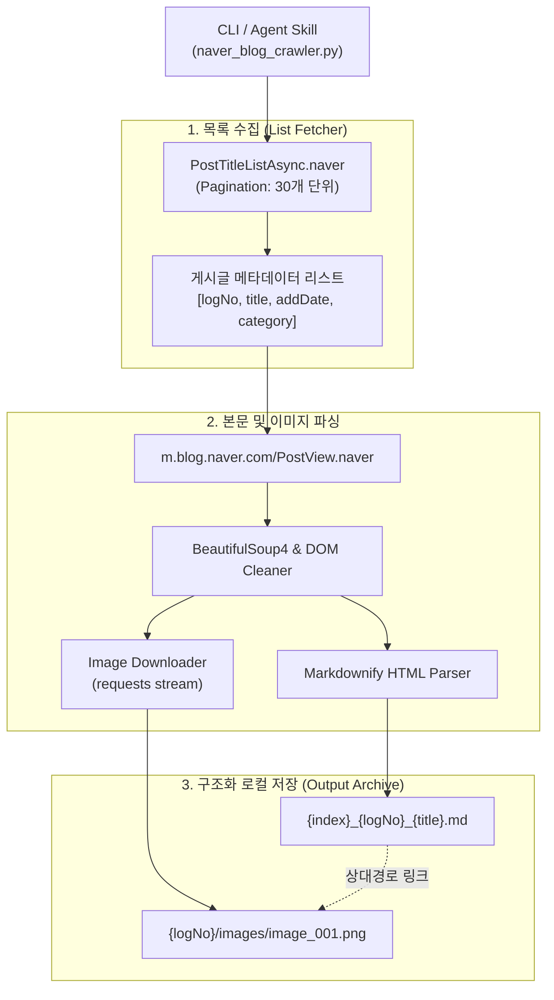

# Naver Blog Crawler & Exporter 📝🕸️

[](https://python.org)
[](https://www.crummy.com/software/BeautifulSoup/)
[](https://github.com/matthewwithanm/python-markdownify)
[](SKILL.md)
[](LICENSE)

특정 네이버 블로그(`blog.naver.com/{blogId}`)의 모든 포스팅을 전자동으로 수집하여 **게시글별 Markdown 문서 + 로컬 이미지 아카이브**로 변환·저장하는 CLI 도구입니다.

독립적인 파이썬 스크립트로 동작할 뿐 아니라, **Claude Code 스킬(`SKILL.md`)** 및 **AI 코딩 에이전트(`AGENTS.md`)**와 완벽히 호환되도록 설계되었습니다.

---

## 🌟 주요 기능 (Features)

- 📑 **비동기 API 기반 전수 수집**: `PostTitleListAsync.naver` 엔드포인트를 활용해 페이지 단위로 블로그의 모든 글 목록(logNo, 제목, 작성일, 카테고리)을 누락 없이 탐색.
- 📱 **모바일 최적화 뷰 파싱**: `m.blog.naver.com` 구조를 분석하여 SmartEditor 3.0 및 레거시 에디터 태그로부터 본문, 텍스트, 코드 블록을 깔끔하게 추출.
- 🖼️ **이미지 로컬 다운로드 및 상대경로 리매핑**: 포스트 내 삽입된 고화질 이미지를 `output/{logNo}/images/`에 로컬 저장하고, 생성되는 마크다운 본문에 상대 경로로 자동 링크.
- ⏱️ **지능형 Rate Limiting & Safe Delay**: 네이버 서버에 무리를 주지 않고 IP 차단 및 캡차 발생을 방지하기 위한 안전한 딜레이(`--delay 0.7s`) 기본 내장.
- 🤖 **AI Agent Skill Ready**: Claude Code 및 OpenAI Codex CLI에서 프롬프트 명령 한 번으로 크롤링을 트리거할 수 있는 메타데이터 명세 포함.

---

## 🏗️ 아키텍처 및 데이터 흐름



---

## 🚀 빠른 시작 (Quick Start)

### 1. 설치
```bash
git clone https://github.com/dontotl/naver-blog-crawler.git
cd naver-blog-crawler
pip install -r requirements.txt
```

### 2. 크롤링 실행
```bash
python naver_blog_crawler.py --blog-id <블로그_아이디> --output-dir ./output
```

예시:
```bash
python naver_blog_crawler.py --blog-id tech-insights --output-dir ./backup_data --delay 0.8
```

---

## ⚙️ CLI 옵션 (Arguments)

| 파라미터 | 필수 여부 | 기본값 | 설명 |
|---|:---:|:---:|---|
| `--blog-id` | **필수** | - | 크롤링 대상 네이버 블로그 ID (예: `blog.naver.com/{blogId}`) |
| `--output-dir` | 선택 | `./output` | 마크다운 및 이미지가 저장될 결과 디렉토리 경로 |
| `--delay` | 선택 | `0.7` | 요청 간격(초). 서버 보호 및 차단 방지를 위해 0.5초 이상 유지 권장 |

---

## 📂 결과물 디렉토리 구조 (Output Sample)

```text
output/
├── 0001_223456789012_오라클 클라우드 기초 아키텍처 정리.md
├── 0002_223456789013_pgvector ANN 벤치마크 분석.md
├── 223456789012/
│   └── images/
│       ├── image_001.png
│       └── image_002.jpg
└── 223456789013/
    └── images/
        └── image_001.png
```

생성된 마크다운 문서 내부:
```markdown
# 오라클 클라우드 기초 아키텍처 정리

- **작성일**: 2026.04.15. 14:30
- **카테고리**: Cloud Architecture
- **원문 링크**: https://blog.naver.com/tech-insights/223456789012

---

본문 내용이 마크다운 문법으로 변환되어 저장됩니다.


```

---

## 🤖 Claude Code / AI 에이전트 스킬로 사용

Claude Code 환경에서 스킬로 사용하려면 글로벌 스킬 디렉토리에 클론합니다:

```bash
git clone https://github.com/dontotl/naver-blog-crawler.git ~/.claude/skills/naver-blog-crawl
```
이후 Claude Code 대화창에서 자연어로 호출할 수 있습니다:
> *"naver-blog-crawl 스킬을 사용해서 `my-blog-id` 블로그 글들을 `./blog_backup` 폴더에 마크다운으로 백업해줘."*

---

## ⚠️ 윤리적 크롤링 및 주의사항 (Ethical Use)

- **개인 소유 블로그 백업 및 연구/아카이빙 목적**으로만 사용하십시오.
- 네이버 이용약관은 무차별 대량 스크래핑을 제한하므로, 요청 딜레이(`--delay`)를 지나치게 낮추거나 무리한 병렬 요청을 수행하지 마십시오.
- 수집된 타인의 저작물(글, 이미지)을 허가 없이 상업적으로 재배포하거나 무단 전재하지 마십시오.

---

## 📄 라이선스 (License)

본 프로젝트는 [MIT License](LICENSE)를 따릅니다.
